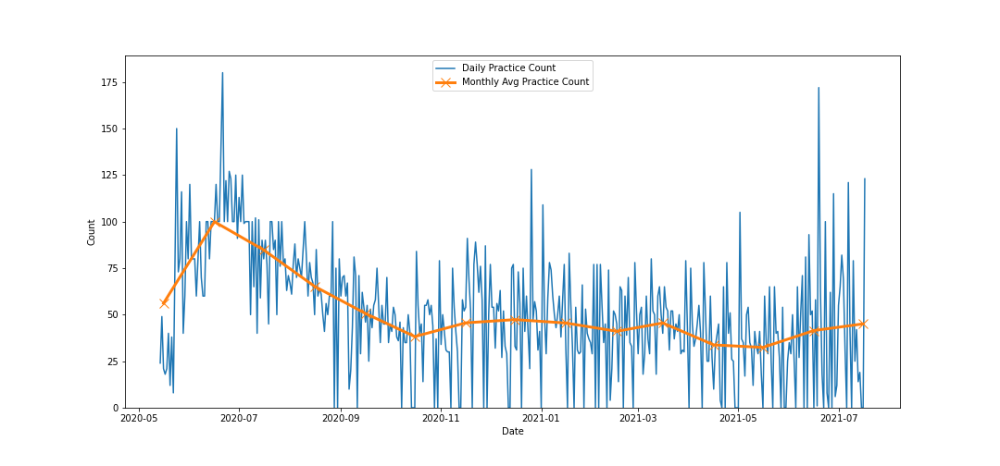
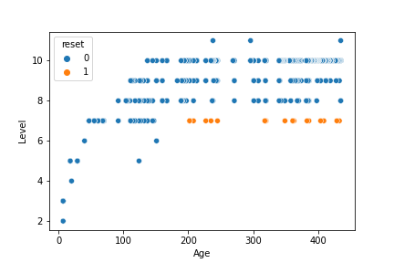
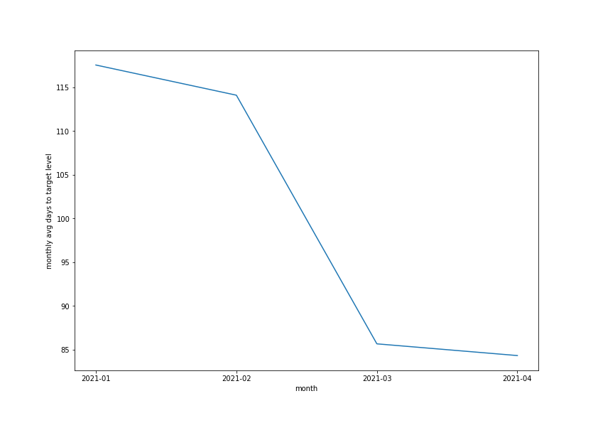
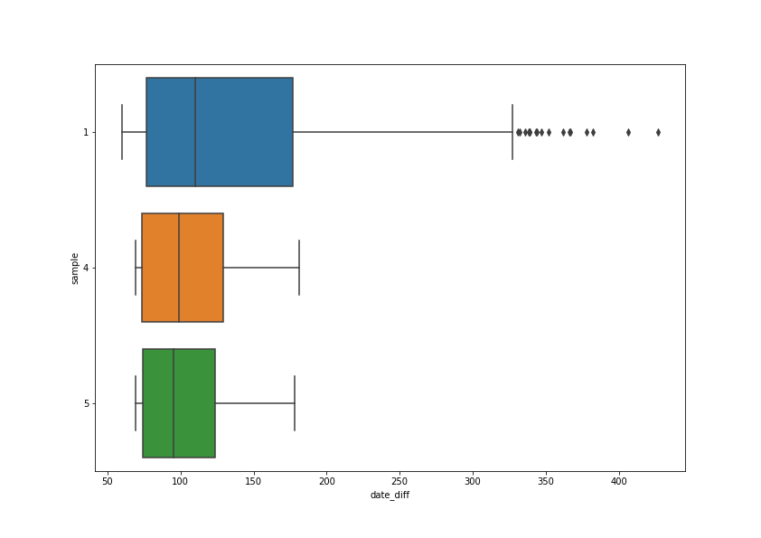

# Japanese Vocabulary Revision Analysis: Overview

Over the work-from-home period of Covid-19 lockdown, I have been taking my Japanese studies more seriously, with a particular focus on writing Kanji. For anyone familiar with Kanji, they can appreciate the vast range of characters required to be mastered, and this was something I have previously struggled with.

While there are great revision apps already on the market, I wanted to kill two birds with one stone and create my own revision program in Python, as another avenue of self-development.

## App Background
I created my own spaced repetition algorithm and populated my own dictionary of vocabulary to study. I created fact and dimensional tables to model my data and track my progress.

My algorithm was experimentally created at first, but then introduced different samples of spaced repetition boundaries to better tune the efficiency of my learning. Spaced repetition is a learning technique that says "the more familiar you become with the thing in question (in my case, vocabulary) the greater the interval between practice attempts increases". I measure this by increasing and decreasing the 'level' of a word after it has been practiced. A word at a low level needs to be practiced more frequently; a word with a high level needs to be practiced less frequently. This is controlled by 'level-up boundaries', which represent the number of days that pass between attempts for words at different levels.

This Data Science project was aimed to help improve my understanding of my learning efforts since May 2020, and guide my findings.

**_TL;DR:_**
* Context: Created a revision algorithm using spaced repetition for studying Japanese vocabulary.
* Built Analysis tool to verify effectiveness on spaced repetition algorithm used.
* Scraped additional detail on vocabulary to provide further insights.
* Practiced vocabulary using different samples of level-up boundaries in spaced repetition algorithm.
* Analysed data to confirm algorithm was appropriately tuned to enhance my efficiency at learning.
* Chose sample with fastest learning rate that also demonstrated long-term recollection.

##  Code and resources
* Python version: 3.7
* Packages: pandas, numpy, matplotlib, seaborn, json, BeautifulSoup, datetime, webbrowser, re, requests

## Data Collection
A lot of the data is separated into different fact and dimension files for reporting purposes and so is not in the correct format to perform analysis on in the raw state. As this was my own dataset, I had created it with this kind of project work in mind so there was not much cleaning that was necessary.

**Existing data:**
* Dimensional Dictionary csv file: Dictionary of words to be practiced

|   Word Index  |    English    |    Hiragana   |      Kanji    |    Date Added | Rank         |    Sample    | Is Active |
| ------------- | ------------- | ------------- | ------------- | ------------- |------------- |------------- |-----------|
|0              | house	        |いえ         	 |家	         |09/05/2020	 |1	            |1             |0          |
|1	            |(someone's) house	|おたく      |お宅            |09/05/2020     |1             |1             |0          |
|...        	|...        	|...        	|...        	 |...        	 |...        	|...           |...        |
|611	        |factory        |こうじょう	      |工場	            |17/02/2021     |3             |4             |1          |
|612	        |last train     |しゅうでん	      |終電	            |17/02/2021     |3	           |5	          |1          |
|...        	|...        	|...        	|...        	 |...        	 |...        	|...           |...        |

* Dimensional Level csv file: Current level of words for algorithm to use

| |  Word Index  |    Level     |    Date   |      Sample    | 
| - |------------- | ------------- | --------- | -------------- | 
|0|0	|10|05/09/2020|	1|
|1|1	|10|05/10/2020|	1|
|2|2	|10|04/10/2020|	1|
|3|3	|8 |07/02/2021|	1|
|...|...	|... |...|...|

* Fact Results csv file: Track attempts over time

|   |  Word Index  |    Index Relation     |    Result  |      Date    |  Time |
| - |------------- | -------------  | --------- | -------------- | ----- | 
|1|35|4|1|14/05/2020|23:39:27|
|2|9|5|1|14/05/2020|23:39:40|
|...|...            |...  |... |...        |...   |
|16890|492|0|1|03/03/2021|18:24:12|
|16891|611|0|1|03/03/2021|18:24:22|
|...|...            |...  |... |...        |...   |

* Fact Level csv file: Track changes in level over time.

| |  Word Index  |    Level     |    Date   |      Sample    | 
| - |------------- | ------------- | --------- | -------------- | 
|1|1	|10|05/10/2020|	1|
|2|	1|	8|	04/08/2020|	1|
|... |...  |... |...        |...   |
|5620|	611|	1|	19/02/2021|	4|
|5621|	612|	1|	19/02/2021|	5|
|... |...  |... |...        |...   |

Note: I have not detailed each column as several are out-of-scope for this project.

The level-up boundaries for each sample is controlled through the following lists:

Sample 1 = [0, 1, 2, 4, 7, 12, 12, 31, 31, 31, 31]

Sample 4 = [0, 1, 2, 3, 5, 10, 10, 31, 31, 31, 31]

Sample 5 = [0, 1, 1, 2, 4, 6, 10, 10, 31, 31, 31, 31]

Each element represents the # days that must pass from the last practiced attempt before the word is next practiced at the given level.

## Data Cleaning
To make all this data usable and useful during analysis, I performed the following actions in the 'data_collection_cleansing' notebook:
* Concatenated data for word-by-word analysis, including success measures
* Scraped missing data descriptions
* Converted date data for time-series analysis purposes

**Missing Data:**
* Japanese Learning Proficiency Test (JLPT) grade
* Generalised level (personal grade boundaries)

I would need to do some scraping to get the JLPT grades for each word / expression, as this was something not included in my data. The ever useful Japanese online dictionary site [Jisho](https://jisho.org/) contained the JLPT grades I needed for this analysis. Looping through each word in my personal dictionary and scraping the relevant JLPT grade from the site was then added to my Pandas DataFrame.

I also wanted some qualitative description of the level values, which demonstrates my mastery of the vocabulary.

## Exploratory Data Analysis
All investigation for this section is carried out through the following notebooks:
'data_analysis'
'check_failures_after_month'

First up is the daily count of practices. We can see that when this project started back in May and June last year the number of daily practices was a lot higher, no doubt enhanced by the initial enthusiasm and energy to the project in lockdown, but also due to the inefficiency of some aspects of the model and algorithm, which required more random practices to ensure all words required that day were practiced. As this was tuned, fewer attempts were required and the numbers generally drop.
Higher activity again at the end are again explainable due to a new release to the app, spurring enthusiasm to revise more.

The scatter plot above shows the age (in days) of a word in the dictionary versus the Level. As we can expect, there is a general trend to this - over time, we expect a word to increase in level until it is retired from practice (level 10).

Most notably, we see that as age increases the levels for each of the words widens and diverges. This investigation gave me some insight I had overlooked initially: Some of the older words (possibly configured with poor level-up boundaries) have not been able to progress completely, and due to the greater time between attempts at higher levels, are more easily forgotten and get stuck at the current level. 

Going back to the EDA phase, another column was added to the DataFrame named 'Reset'. This describes a word that does or does not need to be set back to level zero given its age - this is best described in the revised scatter plot below:

This led me to implement logic in my program which raises these words as a notification for me, giving the option to reset the word back to level 0, for re-practicing. Resetting these means that the words are practiced more frequently again, and I have a better chance of recollection. I will store these refreshed words to keep a specific view on, which will be investigated separate to this project, and not impact these results.

Breaking down the size of my samples gives me confidence that I am evaluating and drawing conclusions on an appropriate sample of data. We are ignoring sample 2 and 3 for the purpose of this research, but do not need to go into this here. Sample 1 also has been subject to many changes in the underlying code during the lifecycle of this project (having been used since the the start), so a subset of this is used for future analysis - I shall explain this a bit later on.

Now that I have some insight into how my data is categorised and what my efforts look like on a day-to-day basis, I want to see how I can improve the efficiency of my studies: minimizing the time to learn a word and maintain long-term recollection of it.

I consider long term recollection as the ability to remember the kanji of a word after 1 month (31 days since the previous attempt).

Before digging into the data and drawing comparisons, I made a note that the data in sample 1 has gone through several iterations as the algorithm has been improved during the creation of the app. As can be seen in the below graph, the month-on-month average number of days for a word to reach level 5 for the sample has decreased over time as the model has improved. Due to this, I am using a subset of this sample from 10/2020 onwards for the subsequent data work.

Comparing the average number of days to this target level for each sample against both each other, and the minimum number of days possible for the sample itself, I found the following results.

*Sample 1*  
Absolute minimum of 69 days to reach level 8 for sample 1  
Number of words in sample at level 8: 83  
Average of 108.83 days to reach level 8 for sample 1  
Observed minimum of 69 days to reach level 8 for sample 1  
Observed maximum of 244 days to reach level 8 for sample 1  

*Sample 4*  
Absolute minimum of 62 days to reach level 8 for sample 4  
Number of words in sample at level 8: 42  
Average of 103.71 days to reach level 8 for sample 4  
Observed minimum of 69 days to reach level 8 for sample 4  
Observed maximum of 181 days to reach level 8 for sample 4  

*Sample 5*   
Absolute minimum of 51 days to reach level 8 for sample 5  
Number of words in sample at level 8: 33  
Average of 104.79 days to reach level 8 for sample 5  
Observed minimum of 69 days to reach level 8 for sample 5  
Observed maximum of 178 days to reach level 8 for sample 5  

The boxplot below gives greater weight to these results, showing the variation between the samples, and how the data truly sits.

We can see that sample 1 has far more outliers than the other samples and the interquartile range is much larger than the other two samples, meaning my practice attempts are more varied.

There is disparity between the sample sizes, with the number of records in sample 1 being almost double that in samples 4 and 5. This is something we can look to normalize in the future, but I believe the number of records in each sample is large enough to provide a good baseline to draw conclusions from.

Looking more specifically at "the ability to perform long term recollection of a word", I've looked at the frequency a word has any failed attempts at the first time it reaches at 31 day gap in practices (when reaching Level 8).  

I found the following:  
Words in Sample 1: 91  
Percent of words including a failure: 28.57%  
Percent of words with no failures: 71.43%  

Words in Sample 4: 52  
Percent words including a failure: 28.85%  
Percent of words with no failures: 71.15%

Words in Sample 5: 50  
Percent of words including a failure: 34.0%  
Percent of words with no failures: 66.0%  

We can see that Sample 1 and 4 generally lead to better long term recollection than Sample 5, being neck and neck at this stage.

## Project Outcome

From combining this analysis, it would appear that Sample 4 is the more reliable sample to use. The box plot shows a tighter interquartile range demonstrating consistent results and the measure of long term recollection also ranks quite highly.

As such, I'll be tuning future Samples using this as a baseline.

## Next Steps
There are a variety of other tests that I could look at in regards to measuring my long-term recollection of the vocabulary/Kanji, and I have listed some of the following avenues to explore later:

* Sample-by-Sample strengths and weaknesses

   I have enough data over enough time to perform analysis into each sample and the success of practicing a word after breaks of various lengths of time. Given that I want to evaluate the performance of each sample, understanding their weak points is important. The below visuals shows the number of occurrences a word decreased from level n to n-1.

   

   We can infer a lot about which Level has been a source of weakness for each Sample(we ignore level 0 as the word is just being learned for the first time and we do expect failures!), hence giving good targets to improve upon and insight into effective spacing between levels.

* Does Kanji complexity impact success?

   The JLPT grades, and 'ranks' I have arbitrarily assigned words based on how difficult I think they look are good indicators of how well I think I will do at recalling them, but we have not seen massive correlation between success and perceived complexity. Looking at the number of "strokes" (lines making up a Kanji) in each word may be a better indicator, and this information should be easy enough to scrape online and add as a column to the DataFrame for future analysis.
   
   On top of this, If a particular Kanji is frequently used, the chances are that I will be better at recalling it (at least when more words using this Kanji are added.
   
